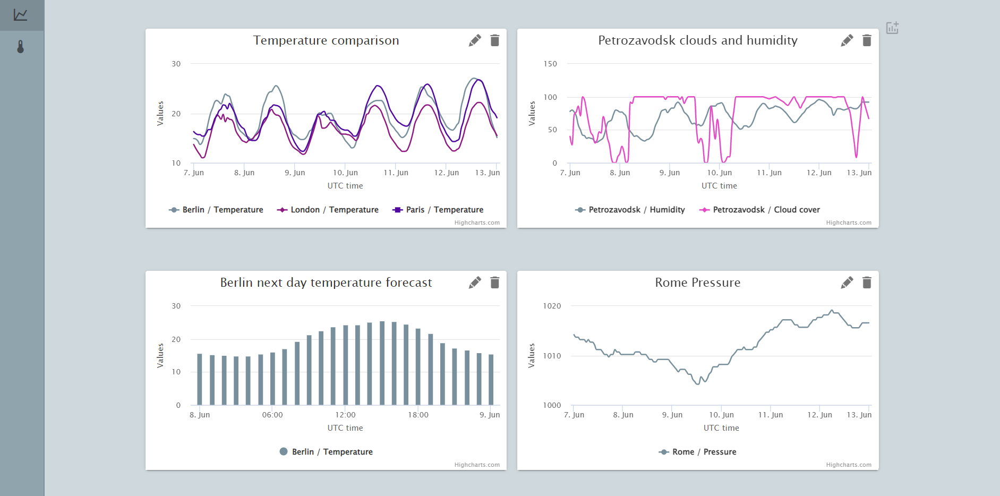
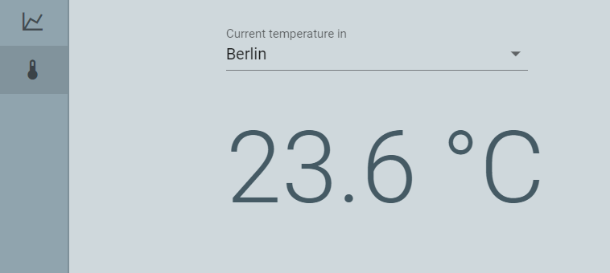
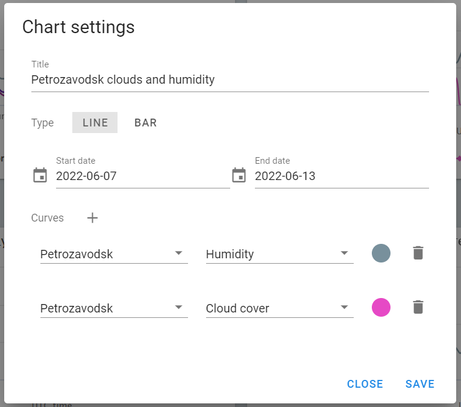

## Weather forecast dashboard


### LIVE site: https://brawny-crime.surge.sh

The application includes two routes:
* dashboard page with 1-4 charts displaying weather forecast variables (temperature, humidity, etc) in different cities
* page showing current temperature value in selected city

A chart can be configured or added via "Chart Settings" view.

## Application screenshots







## Build Setup

```bash
# install dependencies
$ npm install

# serve with hot reload at localhost:3000
$ npm run dev

# build for production and launch server
$ npm run build
$ npm run start

# generate static project
$ npm run generate
```

